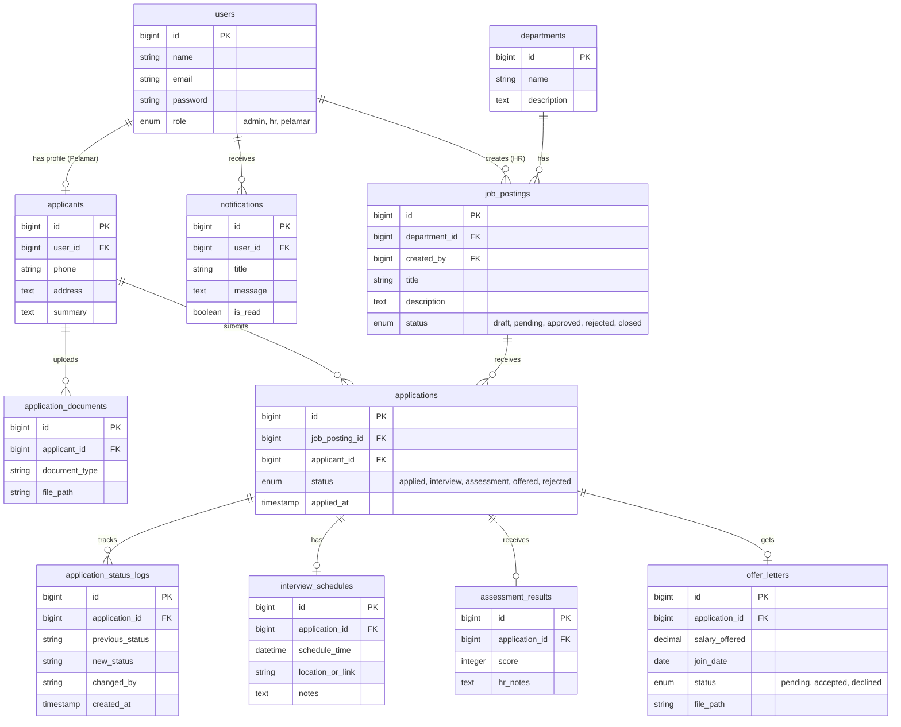

# Product Requirements Document (PRD)
## Nama Aplikasi: RekrutMudah

---

### 1. Ringkasan Produk & Masalah yang Diselesaikan
**RekrutMudah** adalah sebuah sistem rekrutmen karyawan berbasis web yang dirancang untuk merampingkan dan menyederhanakan proses perekrutan dari ujung ke ujung (end-to-end). Sistem ini dibangun khusus untuk memastikan alur kerja HR yang efisien tanpa menggunakan automasi kompleks (AI/ML), sehingga sangat mudah dikontrol dan diawasi. 

**Masalah yang Diselesaikan:**
- Proses pengajuan lowongan yang sering kali berantakan dan tidak terpusat.
- Kurangnya transparansi dalam approval lowongan kerja oleh pihak manajemen/Admin.
- HR sering kesulitan melacak progres pelamar dari mulai screening, wawancara, penilaian, hingga pemberian penawaran kerja (offer letter).
- Pelamar kerja sering kali tidak mengetahui status lamaran mereka karena minimnya notifikasi dan tidak adanya dashboard khusus untuk pelamar.

---

### 2. Permission Matrix

| Fitur / Aksi | Admin | HR | Pelamar |
|---|---|---|---|
| Mengelola Akun User (Admin, HR) | Ya | Tidak | Tidak |
| Mengelola Data Departemen | Ya | Tidak | Tidak |
| Membuat Draft Lowongan Pekerjaan | Tidak | Ya | Tidak |
| Approve / Reject Draft Lowongan | Ya | Tidak | Tidak |
| Melihat Daftar Lowongan Pekerjaan | Ya | Ya | Ya (Approved saja) |
| Mendaftar Akun Pelamar (Self-Registration) | Tidak | Tidak | Ya |
| Melamar Pekerjaan & Upload Dokumen | Tidak | Tidak | Ya |
| Melihat Daftar Pelamar & CV | Ya (Read-Only) | Ya | Tidak |
| Menjadwalkan Interview | Tidak | Ya | Tidak |
| Memberikan Hasil Penilaian (Assessment) | Tidak | Ya | Tidak |
| Menerbitkan Offer Letter | Tidak | Ya | Tidak |
| Menerima/Menolak Offer Letter | Tidak | Tidak | Ya |
| Melihat Riwayat Status Lamaran (Logs) | Ya | Ya | Ya |
| Menerima & Melihat Notifikasi | Ya | Ya | Ya |

---

### 3. Skema Data & Arsitektur

#### a. Penjelasan Naratif Tabel & Relasi

1. **`users` (Bawaan Framework/Template)**
   Menyimpan data otentikasi (nama, email, password). Perbedaan antara Admin, HR, dan Pelamar cukup menggunakan kolom tambahan `role` (enum: `admin`, `hr`, `pelamar`). 
2. **`departments`**
   Menyimpan data divisi atau departemen di dalam perusahaan (contoh: IT, Finance, HR). Berelasi *One-to-Many* dengan `job_postings`.
3. **`job_postings`**
   Menyimpan data lowongan pekerjaan (judul, deskripsi, requirements). Dibuat oleh HR dan memiliki kolom `status` (enum: `draft`, `pending`, `approved`, `rejected`, `closed`). Berelasi *Many-to-One* ke `departments` dan `users` (HR pembuat).
4. **`applicants`**
   Menyimpan profil detail dari pelamar (nomor telepon, alamat, ringkasan profil). Berelasi *One-to-One* dengan `users` (hanya untuk user dengan role `pelamar`).
5. **`application_documents`**
   Menyimpan file lampiran/CV yang diunggah oleh pelamar. Berelasi *One-to-Many* dengan `applicants` (seorang pelamar bisa memiliki banyak dokumen).
6. **`applications`**
   Tabel transaksional utama yang merekam pelamar mana melamar ke lowongan mana. Memiliki `status` (contoh: `applied`, `interview`, `offered`, `rejected`). Berelasi *Many-to-One* ke `applicants` dan `job_postings`.
7. **`interview_schedules`**
   Menyimpan data jadwal wawancara (tanggal, waktu, link meeting/lokasi). Berelasi *One-to-One* atau *Many-to-One* dengan `applications`.
8. **`assessment_results`**
   Menyimpan skor atau catatan hasil wawancara dan penilaian HR terhadap kandidat. Berelasi *One-to-One* dengan `applications`.
9. **`offer_letters`**
   Menyimpan data surat penawaran kerja yang diterbitkan HR beserta status tanggapan dari pelamar (`pending`, `accepted`, `declined`). Berelasi *One-to-One* dengan `applications`.
10. **`application_status_logs`**
    Mencatat histori setiap kali ada perubahan status pada `applications` atau `job_postings` (untuk pencatatan log approval Admin atau log status pelamar). Berelasi *Many-to-One* ke `applications` (bisa juga polimorfik jika ingin menyimpan log `job_postings`).
11. **`notifications`**
    Menyimpan pesan notifikasi internal sistem (bukan email). Berelasi *Many-to-One* ke `users`. 

#### b. Visualisasi ERD (Mermaid)

---

### 4. Alur Bisnis End-to-End (User Flow)

1. **Persiapan Data & Pengajuan Lowongan:**
   - Admin login dan membuat data master Departemen.
   - HR login dan membuat draft lowongan pekerjaan. HR mengirimkan lowongan tersebut untuk di-review (status menjadi `pending`).
2. **Approval Lowongan:**
   - Admin menerima notifikasi ada lowongan baru.
   - Admin meninjau lowongan, lalu menekan tombol **Approve** (status menjadi `approved` dan tayang di publik) atau **Reject** (kembali ke HR untuk direvisi).
3. **Pendaftaran & Melamar Pekerjaan:**
   - Pelamar melakukan registrasi akun di portal karir RekrutMudah.
   - Pelamar melengkapi profil (`applicants`) dan mengunggah CV (`application_documents`).
   - Pelamar melihat lowongan yang `approved` dan menekan tombol **Apply** (`applications` terbentuk dengan status `applied`).
4. **Seleksi & Penjadwalan Interview:**
   - HR melihat daftar lamaran masuk.
   - HR memindahkan status lamaran ke `interview` dan membuat jadwal di `interview_schedules`.
   - Pelamar mendapat notifikasi jadwal interview.
5. **Penilaian (Assessment):**
   - Setelah interview selesai, HR menginput nilai dan catatan di `assessment_results`.
   - HR mengubah status lamaran menjadi `offered` (jika lolos) atau `rejected` (jika gagal).
6. **Offering Letter:**
   - Untuk kandidat yang lolos, HR membuat `offer_letters`.
   - Pelamar menerima notifikasi, melihat offer letter, dan dapat menekan tombol **Terima** atau **Tolak**.
   - Jika diterima, proses rekrutmen selesai dan HR dapat mengubah status job_posting menjadi `closed`.

---

### 5. Daftar Fitur Utama per Role

#### 👨‍💻 Fitur Admin (Pengawas & Master Data)
- **Manajemen User:** CRUD data HR dan Admin.
- **Manajemen Departemen:** CRUD data master divisi perusahaan.
- **Approval Lowongan:** Review, setujui (Approve) atau tolak (Reject) pengajuan lowongan dari HR.
- **Dashboard Monitoring:** Melihat statistik jumlah lowongan aktif, total pelamar, dan histori log aktivitas (Read-only).

#### 👩‍💼 Fitur HR (Operasional Rekrutmen)
- **Manajemen Lowongan:** Create draft lowongan, ajukan ke Admin, edit, dan tutup lowongan (Close).
- **Manajemen Pelamar (Applicant Tracking):** Melihat daftar pelamar per lowongan, mengunduh CV.
- **Penjadwalan Interview:** Membuat dan mengirim jadwal wawancara ke kandidat.
- **Input Penilaian:** Mengisi form `assessment_results` pasca-wawancara.
- **Penerbitan Offering:** Mengunggah dan mengirimkan surat penawaran (offer letter).

#### 🧑‍🎓 Fitur Pelamar (Kandidat)
- **Otentikasi & Profil:** Register, Login, kelola profil data diri.
- **Manajemen Dokumen:** Mengunggah CV/Portfolio.
- **Eksplorasi Lowongan:** Melihat daftar lowongan pekerjaan yang sedang aktif/tayang.
- **Apply & Tracking:** Melamar pekerjaan dan memantau status lamaran (Applied, Interview, Rejected, Offered).
- **Tanggapan Offering:** Menyetujui atau menolak offering letter.

---

### 6. Prioritas Fitur

#### 🚀 Fitur Wajib (MVP - Minimum Viable Product)
Fitur-fitur ini harus selesai terlebih dahulu agar alur rekrutmen dasar berjalan dengan baik:
1. Otentikasi dan Role Management (Admin, HR, Pelamar) dari tabel `users`.
2. CRUD `departments` oleh Admin.
3. Alur Lowongan: HR Create Draft -> Admin Approve -> Lowongan Tampil di halaman publik.
4. Pelamar Register, melengkapi Profil, dan bisa Apply Lowongan.
5. HR melihat daftar pelamar dan bisa mengubah status (Accept/Reject sederhana).
6. Log riwayat perubahan status sederhana (`application_status_logs`).

#### 🌟 Fitur Tambahan (Nice to Have)
Fitur ini dikerjakan setelah MVP berjalan dengan sempurna, menyesuaikan sisa waktu pengerjaan UAS:
1. **Modul Interview:** `interview_schedules` (pengaturan jadwal yang rapi dengan kalender/waktu).
2. **Modul Penilaian:** `assessment_results` (form skor terperinci bagi HR).
3. **Modul Offering:** `offer_letters` (sistem penerbitan surat kontrak resmi dan respon acc/decline dari pelamar).
4. **Notifikasi In-App:** `notifications` (lonceng notifikasi realtime/database-driven). 
